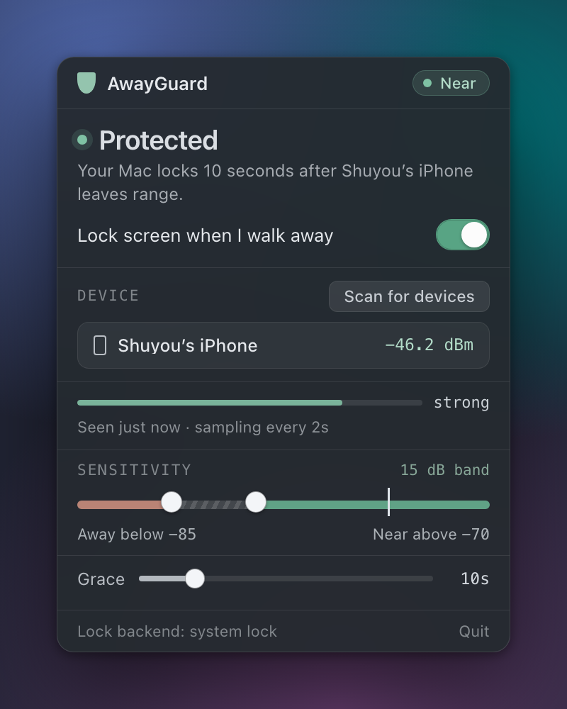
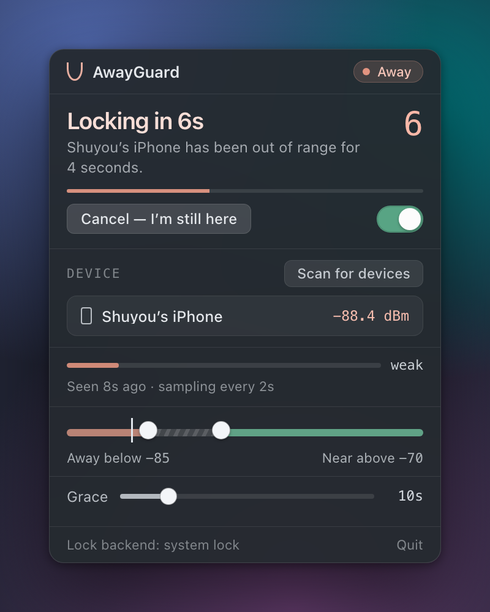
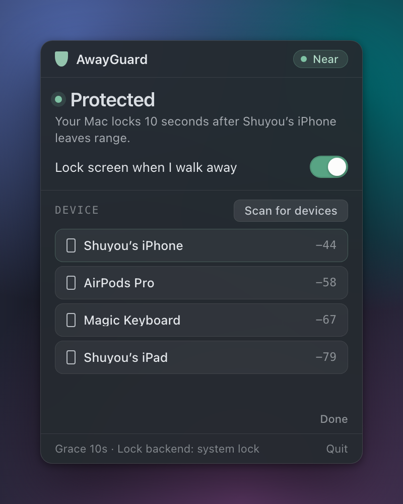
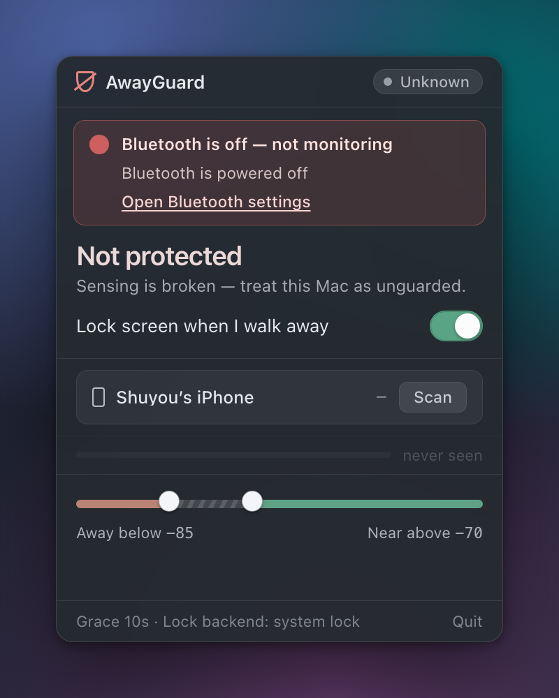

# AwayGuard

**A macOS menu bar app that locks your Mac when you walk away from it.**

AwayGuard watches the Bluetooth signal from your iPhone. When the phone leaves range it starts a
short countdown, and if you don't come back it locks the screen. No idle timer, no waiting three
minutes for a screensaver to decide you're gone — it locks because *you* left, not because the
keyboard went quiet.

<p align="center">
  
</p>

---

## Why proximity instead of an idle timer

An idle timer measures the wrong thing. It's simultaneously too slow (your Mac sits unlocked for
minutes after you've left the room) and too eager (it locks while you're reading the screen). The
fact that actually matters is whether *you* are still at the desk, and the phone in your pocket is a
good proxy for that.

The tradeoff is that Bluetooth RSSI is noisy — measurements on real hardware show roughly 20 dB of
spontaneous swing while a phone sits perfectly still on a desk. So the interesting part of AwayGuard
isn't reading a signal strength; it's deciding, from a jittery signal, when a departure is real.
See [How it decides](#how-it-decides).

## The popover

Everything lives in one 320 × 420 pt panel under the menu bar icon. It has one rule: **the headline
reports what the backend is actually doing, never what you asked for.** If the arm switch is on but
Bluetooth is off, the headline still reads "Not protected" — the switch is a wish, the headline is a
fact.

| Counting down | Picking a device |
| --- | --- |
|  |  |
| A confirmed departure starts the grace period. **Cancel — I'm still here** dismisses exactly one pending lock and leaves the guard armed for the next real departure. | Scanning lists nearby named BLE peripherals with their current RSSI, so you pick the phone by the number as well as the name. |

| When something is broken |
| --- |
|  |
| A broken sensing chain is never swallowed, because a silent failure looks exactly like "safe". The banner carries the adapter's own words and, where one exists, a button that opens the settings pane that fixes it. |

The menu bar icon is a padlock with five states — dimmed (no device), hairline (disarmed), solid
(protected), lifting shackle (departure pending), slashed (sensing broken). Shape carries the state,
so it survives monochrome menu bar rendering and colour blindness.

## How it decides

Each poll runs the same pipeline. Every stage exists to keep noise from becoming a lock.

```
BLE scan (every 2s)
   │  RSSI sample, or "not seen at all"
   ▼
Exponential smoothing (α = 0.35)          ← rides out one-off 20 dB dips
   ▼
Hysteresis band (near −70 / away −85)     ← readings between the two are no evidence at all
   ▼
Confirmation streak (3 consecutive)       ← one stray sample can never flip the state
   ▼
Grace countdown (10s, cancellable)        ← you get a window to come back
   ▼
Screen lock
```

A few details that matter:

- **Not seeing the phone at all is treated as away-evidence**, and deliberately does not pollute the
  smoothed value with a fabricated reading. A peripheral that has been silent for 10 seconds counts
  as departed even if its last cached RSSI was strong.
- **An inconclusive sample resets the streak.** Partial evidence never carries over, so a transition
  always needs a full fresh run of consistent readings.
- **A sensor fault is not a sighting.** An erroring adapter and an absent phone both mean "no fresh
  evidence", and neither is allowed to imply presence.
- **Thresholds apply live.** Editing sensitivity or grace takes effect without a restart, and
  without resetting the smoothed value or an in-progress confirmation streak.
- **The config can't fail open.** If `near_dbm` and `away_dbm` are crossed, equal, or closer than
  12 dB, they're widened back to a usable band — enforced both on save *and* on load, so a config
  hand-edited or written by an older build can't produce an app that looks armed but never locks.

## Requirements

- macOS with Bluetooth LE hardware (developed and tested on macOS 26)
- An iPhone, or any BLE device you keep on you, that advertises with a name
- [Rust](https://rustup.rs), [pnpm](https://pnpm.io), and Xcode Command Line Tools to build

## Build and run

```sh
pnpm install
pnpm tauri dev      # run in development
pnpm tauri build    # produce AwayGuard.app
```

Other useful commands:

```sh
pnpm check                                    # svelte-check over the frontend
cargo test --manifest-path src-tauri/Cargo.toml   # the proximity, timer and monitor logic
```

The proximity tracker, grace timer and monitor loop are all pure and clock-injected, so the decision
logic is covered by ordinary unit tests with no Bluetooth hardware and no sleeping. The parts that
genuinely need the machine — the BLE adapter, the lock call, the menu bar — are the thin edges
around them.

## First run

1. Launch AwayGuard. It appears only in the menu bar (`LSUIElement`), with no Dock icon or window.
2. Click the icon, then **Scan for devices**. macOS asks for Bluetooth permission the first time.
3. Pick your iPhone from the list. Keep it near you — the strongest reading is usually it.
4. Turn on **Lock screen when I walk away**.

AwayGuard starts disarmed with no device selected, and never inherits an armed state from a config
it couldn't fully parse.

## Settings

| Setting | Default | What it does |
| --- | --- | --- |
| Device | none | The BLE peripheral whose signal stands in for you |
| Away below | −85 dBm | Smoothed RSSI at or under this counts as evidence you've left |
| Near above | −70 dBm | Smoothed RSSI at or over this counts as evidence you're back |
| Grace | 10s | How long after a confirmed departure before the screen locks |
| Confirm samples | 3 | Consecutive consistent readings needed to change state |

Readings between the two thresholds are deliberately inconclusive — that gap is the hysteresis band,
and it is what stops the state from flapping. The UI won't let you make it narrower than 12 dB.

**Tuning.** If your Mac locks while you're still sitting at it, lower **Away below** (say −90) or
raise **Grace**. If it takes too long to lock after you leave, raise **Away below** toward −80.
The live reading and the "strong / steady / weak" verdict in the panel are judged against *your*
thresholds, so you can tune by walking to the door and watching where the number lands.

Settings live in `~/Library/Application Support/com.shuyou.awayguard/config.json`.

## How it locks

AwayGuard prefers `SACLockScreenImmediate` from the private `login.framework`, which is what the
menu bar's own Lock Screen item uses — an immediate, real lock. If that symbol can't be resolved it
falls back to starting the screen saver, which only locks if you've enabled "Require password after
screen saver begins". macOS no longer lets an app read that setting, so AwayGuard can't verify it —
and rather than pretend, it says so: the footer names the backend in use, and the fallback path
raises a banner pointing at Lock Screen settings.

## Project layout

```
src/                    SvelteKit frontend — the popover
  lib/present.ts        backend state → the words and numbers on screen
  lib/components/       shield, badges, meters, sliders, banner, device list
src-tauri/src/
  ble.rs                Core Bluetooth scanning and RSSI sampling (btleplug)
  proximity.rs          smoothing, hysteresis, confirmation streak
  monitor.rs            the poll loop, liveness, grace timer
  lock.rs               screen lock backends and their detection
  tray_glyph.rs         the menu bar padlock, drawn per state
  lib.rs                app wiring, tray, popover positioning
```

## Known limitations

**The popover does not open over a full-screen app.** Clicking the menu bar icon while another app
is in full screen does nothing visible. The icon and the lock monitoring itself are unaffected —
only the panel is. Leave full screen and it opens normally.

This is a structural limitation rather than a missing setting, and the following have been measured
and ruled out: the panel already carries `CanJoinAllSpaces | FullScreenAuxiliary` and sits at
`NSStatusWindowLevel`, and with all three in place `isOnActiveSpace` still reports `false` over a
full-screen app. The window is shown, focused and fully opaque the whole time — just on a Space the
user is not looking at.

The cause is upstream of those knobs: opening the panel calls `set_focus`, which activates the app,
and activating is incompatible with staying on another app's full-screen Space. Fixing it means
replacing the plain `NSWindow` Tauri creates with a non-activating `NSPanel`
(`NSWindowStyleMaskNonactivatingPanel`), which is how menu bar apps normally do this. That touches
window creation and lifetime, the `windowEffects` vibrancy layer, the dismiss-on-focus-loss handling,
and keyboard focus for the controls in the panel, so it is deliberately left undone for now.

**Not distributable through the Mac App Store.** The popover's transparency and vibrancy need
Tauri's `macos-private-api` feature, and the preferred lock path uses a private framework symbol.

## License

Apache License 2.0 — see [LICENSE](LICENSE).
